# 🦙 Dal-AI-Llama

⚡️ Getting liability assessments with ease ⚡

## 🏃🏼‍♂️ Running the app

be sure to run the code in the src/ directory

```bash
cd src/
uvicorn main:app --reload
```

Read the docs at <http://127.0.0.1:8000/docs>
Or don't, we don't care.

## 🤔 What is this?

A state-of-the-art language model-based solution designed for insurance companies
It focuses on automating responses to emails, providing guidance on handling insurance claims, and aiding in liability assessment using Large Language Models (LLMs).
Developed in collaboration between ZHAW and AXA, it represents a pioneering approach in the intersection of AI and insurance.

## 🚀 What can this help with?

DalAiLlama assists insurance claim handlers in various tasks:
* analyzing case facts
* researching legal articles
* consulting legal literature and court decisions
* and making liability assessments

It streamlines these processes through its integration of LLMs, offering a more efficient, accurate, and user-friendly approach to handling complex insurance cases.
This tool is particularly beneficial for insurance professionals, significantly reducing the time and effort required to navigate the often complex and nuanced realm of insurance claims and liability determinations.

## 🏠 Architecture

```mermaid
flowchart TD
    A[Schadenmeldung / Schilderungen der Beteiligten / Zeugenberichte] -->|An Endpoint senden| B(Sachverhalt analysieren)
    B --> C[Relevante Gesetzartikel suchen]
    C --> D[Prüfen ob gegen Gesetzartikel verstossen wurde]
    D --> E{SLK relevant}
    E -->|Ja| F[Verhalten gegen Empfelung prüfen]
    F --> G[Haftungsquote mit Begrüdung]
    G --> I[Antwort über FastAPI Endpoint senden]
    E -->|Nein| H[fa:fa-pen To be implemented]
```




## 📖 Documentation

Please, our code is self-documenting. Just read it.

## 🐍 Python Version

This project is built with Python 3.11.1.

## 💁 Contributing

As an open-source project in a rapidly developing field, we are extremely open to contributions, whether it be in the form of a new feature, improved infrastructure, or better documentation.

## 🫶🏼 Thanks

We want to thank our teacher Elena and our project lead Robin for their relentless suport and guidance.
